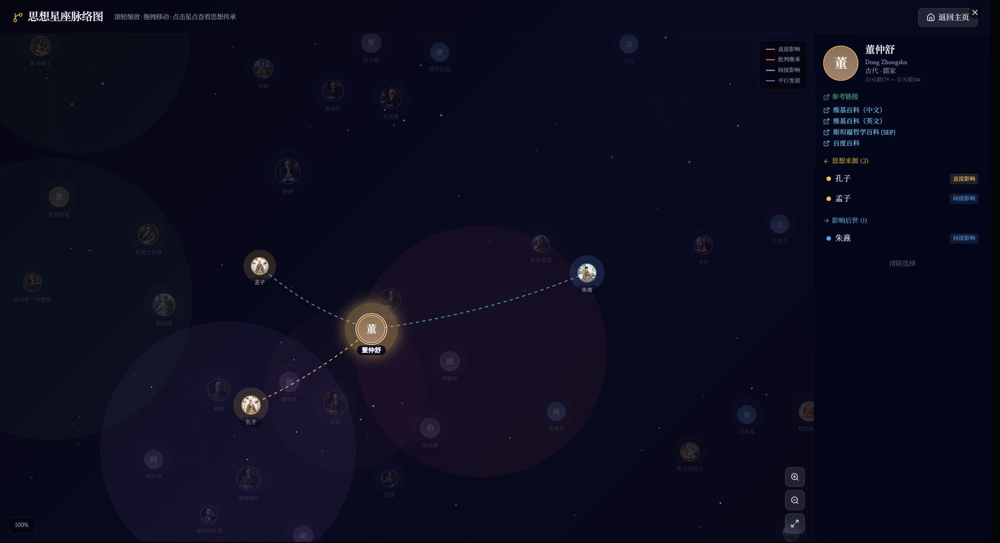
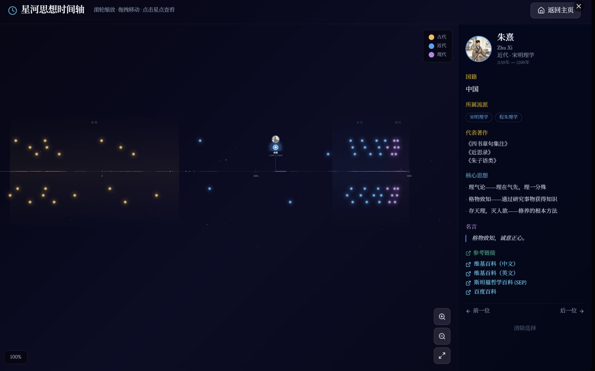

# 哲思人物志 - 哲学家智能体画廊

> 与 59 位中外思想家跨越时空对话

---

## ⚙️ API 配置（必读 - 部署前第一步）

 philosopher AI 对话功能需要一个 **OpenAI 兼容的大模型 API** 来驱动。请在启动应用前完成以下配置。

### 第一步：获取 API Key

选择以下任一服务商，注册并获取 API Key：

| 服务商 | 注册地址 | API Key 格式 | 推荐模型 |
|--------|---------|-------------|---------|
| **OpenAI** | https://platform.openai.com | `sk-...` | `gpt-4o-mini` |
| **DeepSeek** | https://platform.deepseek.com | `sk-...` | `deepseek-chat` |
| **Moonshot (Kimi)** | https://platform.moonshot.cn | `sk-...` | `moonshot-v1-8k` |
| **通义千问** | https://dashscope.aliyun.com | `sk-...` | `qwen-plus` |

### 第二步：创建配置文件

在项目根目录下，将 `.env.example` 复制为 `.env`：

```bash
# Linux / macOS
cp .env.example .env

# Windows
copy .env.example .env
```

### 第三步：填写你的 API 信息

用文本编辑器打开 `.env` 文件，修改以下三项：

```ini
# 你的 API Key（必填）
OPENAI_API_KEY=sk-你的真实API_Key

# API 基础地址（根据服务商选择）
OPENAI_BASE_URL=https://api.openai.com/v1

# 模型名称（根据服务商选择）
OPENAI_MODEL=gpt-4o-mini
```

**各服务商完整配置示例：**

<details>
<summary>🔹 OpenAI 配置</summary>

```ini
OPENAI_API_KEY=sk-你的Key
OPENAI_BASE_URL=https://api.openai.com/v1
OPENAI_MODEL=gpt-4o-mini
```
</details>

<details>
<summary>🔹 DeepSeek 配置</summary>

```ini
OPENAI_API_KEY=sk-你的Key
OPENAI_BASE_URL=https://api.deepseek.com/v1
OPENAI_MODEL=deepseek-chat
```
</details>

<details>
<summary>🔹 Moonshot (Kimi) 配置</summary>

```ini
OPENAI_API_KEY=sk-你的Key
OPENAI_BASE_URL=https://api.moonshot.cn/v1
OPENAI_MODEL=moonshot-v1-8k
```
</details>

<details>
<summary>🔹 通义千问配置</summary>

```ini
OPENAI_API_KEY=sk-你的Key
OPENAI_BASE_URL=https://dashscope.aliyuncs.com/compatible-mode/v1
OPENAI_MODEL=qwen-plus
```
</details>

> **注意：** `.env` 文件已在 `.gitignore` 中排除，不会被上传到 GitHub。请勿将 API Key 硬编码在代码中或提交到版本库。

### 验证配置是否生效

启动服务后，访问健康检查接口：

```bash
curl http://localhost:3016/health
```

如果返回 `"hasApiKey": true`，说明 API Key 已正确加载。

---

## 项目简介

哲思人物志是一个交互式哲学家知识库与 AI 对话应用，涵盖 **59 位中外思想家**，跨越古今中外多个哲学流派。

### 功能特性

- **哲学家画廊**：浏览 59 位哲学家的生平、核心思想、名言、著作和影响
- **AI 对话**：选择任意哲学家，以该哲学家的口吻和思想进行 AI 对话
- **多维筛选**：按时代、流派（35 个）、主题（30 个）筛选哲学家
- **思想对比**：选择 2–4 位哲学家并排对比；「同一问题 · 不同看法」可让多位思想家就同一问题各自 AI 作答并对比差异（对比面板从右侧滑入，支持滚轮浏览）
- **PVE 思辨闯关**：关卡制知识对战。选择哲学家就指定议题进行思辨对谈，AI 从相关性 / 深度 / 逻辑 / 原创性 / 文明度五维评分，关卡线性解锁、进度本地持久化
- **思想脉络图**：可视化展示哲学家之间的思想传承关系
- **时间轴**：按时间线查看哲学家的历史分布

### 哲学家覆盖范围

| 时代 | 流派 | 代表哲学家 |
|------|------|-----------|
| 古代 | 古希腊哲学 | 苏格拉底、柏拉图、亚里士多德 |
| 古代 | 道家 | 老子、庄子 |
| 古代 | 儒家 | 孔子、孟子、荀子、董仲舒 |
| 古代 | 法家 | 韩非 |
| 古代 | 墨家 | 墨子 |
| 古代 | 佛教 | 释迦牟尼、龙树 |
| 古代 | 斯多葛学派 | 爱比克泰德、塞内卡、马可·奥勒留 |
| 古代 | 新柏拉图主义 | 普罗提诺 |
| 古代 | 印度哲学 | 奥义书哲人、商羯罗 |
| 近代 | 启蒙思想 | 伏尔泰、卢梭 |
| 近代 | 理性主义 | 笛卡尔、斯宾诺莎、莱布尼茨、帕斯卡 |
| 近代 | 经验主义 | 洛克、休谟、贝克莱 |
| 近代 | 德国古典哲学 | 康德、黑格尔 |
| 近代 | 功利主义 | 边沁、密尔 |
| 近代 | 唯意志论 | 叔本华 |
| 近代 | 实证主义 | 孔德 |
| 近代 | 宋明理学 | 朱熹、王阳明、王夫之 |
| 近代 | 禅宗 | 慧能 |
| 现代 | 存在主义 | 克尔凯郭尔、尼采、海德格尔、萨特、波伏娃、加缪 |
| 现代 | 现象学 | 胡塞尔 |
| 现代 | 分析哲学 | 罗素、维特根斯坦 |
| 现代 | 马克思主义 | 马克思 |
| 现代 | 后现代主义 | 福柯、德里达、德勒兹 |
| 现代 | 法兰克福学派 | 阿多诺 |
| 现代 | 生命哲学 | 柏格森 |
| 现代 | 政治哲学 | 阿伦特、罗尔斯 |

---

## 快速开始

### 环境要求

- **Node.js** >= 18
- **npm** 或 **pnpm**

### 安装

```bash
# 克隆仓库
git clone https://github.com/你的用户名/philosophers-gallery.git
cd philosophers-gallery

# 安装依赖
npm install
```

### 配置

按照本文档顶部的 [API 配置](#️-api-配置必读---部署前第一步) 章节完成 `.env` 文件配置。

### 启动

```bash
# 方式一：一键启动（Windows）
start.bat

# 方式二：手动启动前后端
npm run dev          # 启动前端 (端口 3015)
node server/index.js # 启动后端 (端口 3016)
```

启动后访问 http://localhost:3015 即可使用。首页顶部导航含「闯关」入口（PVE 思辨闯关）；思想家卡片右上角按钮可收藏 / 对话 / 加入对比。

### 构建生产版本

```bash
npm run build    # 构建前端到 dist/
npm run preview  # 预览构建结果
```

---

## 技术架构

```
┌─────────────────────────────────────────────────┐
│                   浏览器 (:3015)                  │
│  React + Vite + TanStack Router + Tailwind CSS  │
└──────────────────┬──────────────────────────────┘
                   │ /sb-api/* (Vite Proxy)
                   ▼
┌─────────────────────────────────────────────────┐
│              本地后端服务器 (:3016)                │
│         Node.js HTTP Server (ES Module)          │
│  ┌─────────────────────────────────────────┐    │
│  │  哲学家系统提示词 (59 位)                  │    │
│  │  OpenAI 兼容 API 流式转发 (SSE)           │    │
│  └─────────────────────────────────────────┘    │
└──────────────────┬──────────────────────────────┘
                   │ HTTPS
                   ▼
┌─────────────────────────────────────────────────┐
│          OpenAI 兼容 LLM API 服务                │
│  (OpenAI / DeepSeek / Moonshot / 通义千问)       │
└─────────────────────────────────────────────────┘
```

### 项目结构

```
├── src/
│   ├── data/
│   │   └── philosophers.ts      # 59 位哲学家数据 + 筛选选项 + 传承关系
│   ├── services/
│   │   └── philosopherAI.ts     # AI 对话服务（流式 SSE）
│   ├── components/               # React 组件
│   ├── routes/                   # 页面路由
│   └── main.tsx                  # 应用入口
├── server/
│   ├── index.js                 # 后端服务器（端口 3016）
│   └── philosopherPrompts.js    # 59 位哲学家 AI 系统提示词
├── .env.example                 # 配置文件模板
├── .env                         # 你的实际配置（不入库）
├── start.bat                    # Windows 一键启动
├── vite.config.ts               # Vite 配置（含代理）
└── package.json
```

---

## 自定义

### 添加新哲学家

1. 在 `src/data/philosophers.ts` 的 `philosophers` 数组中添加新的哲学家对象
2. 在 `server/philosopherPrompts.js` 中添加对应的 AI 系统提示词
3. 在 `influenceRelations` 数组中添加思想传承关系
4. 在 `filterOptions` 中添加新的流派/主题（如需要）

### 修改 AI 模型

编辑 `.env` 文件中的 `OPENAI_MODEL` 字段即可切换模型，无需修改代码。

---

## License

MIT

## 界面截图

### 1. 哲思殿堂 · 首页

首页以卡片网格展示 59 位东西方哲学家；顶部搜索栏可按姓名实时检索，下方提供按流派 / 时代的筛选与视图切换；每张卡片显示头像、姓名、流派与时代标签。

### 2. 思想星座脉络图

以节点—连线呈现思想家之间的师承与影响关系网络，支持拖拽、缩放，点击节点查看关系详情。

### 3. 星河思想时间轴

按时间顺序横向铺开的思想史星河，可定位到具体思想家（如朱熹，1130–1200）查看生卒年、时代与主要贡献。

### 4. 思辨闯关 · PVE 关卡

知识对战 PVE 玩法，以思想家命名关卡（苏格拉底 → 孔子 → 老子 → 柏拉图 → 亚里士多德 → 笛卡尔 → 休谟 → 斯宾诺莎 → 康德 → 卢梭 → 洛克 → 伏尔泰），每关显示难度、奖励积分与通关进度。

> 更详细的图文说明见 [screenshots/gallery/README.md](screenshots/gallery/README.md)。
